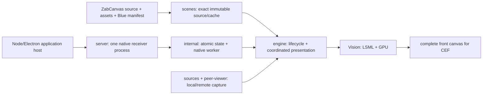

# Solar responsibilities and extension boundaries

Solar is one renderer with three entry boundaries: the ESM mount API, standalone browser
host, and Node reception host. Program and Preview subscribe to different native resources;
they have independent renderer instances and may share immutable source/cache/capture adapters.
Scene identity comes from the native document, never from an obsolete URL scene selector.

| Responsibility                                                         | Owner / extension rule                                                                                                                                                             |
| ---------------------------------------------------------------------- | ---------------------------------------------------------------------------------------------------------------------------------------------------------------------------------- |
| Public mount/options and host configuration                            | Root README, `src/index.ts`, `src/types/index.ts`, `src/mount.ts`, HTML entries. Test selection uses `nativeLSDP.selector`; removed `scene`/`testSession` options had no consumer. |
| Immutable source, revision/asset/Blue pins and bounded cache           | [scenes](../../src/scenes/README.md). Extend `SceneSourceProvider`/`SceneSourceStore`; live variants never enter the immutable cache.                                              |
| Native checksums, Merkle integrity and atomic operations               | [internal](../../src/internal/README.md). Share normative primitives between browser and Node; keep transport bytes and integrity checks intact.                                   |
| Renderer state machine, coalescing, media, animations and compensation | [engine](../../src/engine/README.md). Add presentation behavior at its existing owner; ordered commands drain scalar frames.                                                       |
| Capture mapping and receive-only rooms/slots                           | [sources](../../src/sources/README.md), [peer viewer](../../src/peer-viewer/README.md). Add a host adapter, preserve stream/bitmap ownership and explicit empty slots.             |
| Receiver process, resources, readiness and child recovery              | [server](../../src/server/README.md). The application owns startup/shutdown; browser code never creates a daemon.                                                                  |
| Installation-only upstream compatibility                               | [peer installer](../../scripts/peer-viewer/README.md). Only consumed WebRTC modules may be patched; no legacy renderer corrections.                                                |
| Build/discovery/qualification                                          | [tools](../../scripts/README.md). Current tools have owners; phase-specific generators remain with historical evidence.                                                            |

The lifecycle roots keep related state and callback ownership together: splitting them by
line count would obscure generation, cancellation and compensation. Every handwritten file
remains within the 1,000-line policy; generated lock/WASM glue have individual exceptions.
No generic utility drawer or alternate renderer is retained.
Formatting excludes generated maps, lockfiles, historical evidence and byte-pinned
upstream runtime files through `.prettierignore`; their dedicated generators/pin checks
remain authoritative.

Blue validation belongs to ZabCanvas and execution to Orion. Solar checks source identity,
manifest integrity, transport state and execution/presentation receipts; it does not decide
whether a Blue's business result is true. Application startup, capability provisioning,
credential renewal and durable per-account storage policy remain host responsibilities.

[The generated code map](code-map.md) covers each source file, symbols, imports/dependencies,
product consumers, nearest owner and direct tests. Query the live graph with
`npm run code:read -- <path-or-symbol>` / `npm run code:find -- <query>`; regenerate with
`npm run code:map`. Static usage is checked separately from emitted source maps, byte pins,
unit contracts, installed packaging and actual CEF evidence.

Validation: `npm run check:architecture`, `npm run test:architecture`, lint/types/unit tests,
build/layout/bundle/native pins and the relevant installed/CEF driver. The historical ADR
records a prior implementation; it is not the current operational contract.

The [5 October 2026 maintenance audit](../../evidence/local-20261005-solar-audit/forge/20261005T184644Z-audit.md)
records the removals, retained public contracts, installation compatibility hashes and
current documentation checks. Its scope is local Solar; the CEF evidence remains attached
to its qualified renderer bytes.
